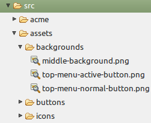
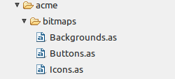

embedgen
========

Generating \[Embed\] metadata for images (Flex specific)

Suppose you are a little grasshoper.. Oh wait, that's not it. So, back to code.

Flex has neat mechanism for working with images by way of *embeding* them. The problem is that if your have to embed more than 3 images it starts to became tedious. The little jar that `maven package` generates is supposed that to partly automate specification of *Embed* classes 

So let start with the images. Usually in a Flex projects images are in the `src\assets` folder like in the following image:



We add at the root of the Flex project an `embed.properties` file with the following content

```
src.path            = src/
                    
bitmaps.package     = acme.bitmaps
bitmaps.classes     = Backgrounds,Buttons,Icons
                    
Icons.path          = assets/icons
Icons.scale9        = no

Backgrounds.path    = assets/backgrounds
Backgrounds.scale9  = yes

Buttons.path        = assets/buttons
Buttons.scale9      = yes

```

I hope the format is self-explanatory. 

Then in the terminal switch to the root your project (where the `embed.properties` file is) and run the command

`$ java -jar embedgen.jar

The result can be seen in the following image:



and here is the `Backgrounds` class

```ActionScript
package acme.bitmaps {
	public class Backgrounds {
		[Embed(source="/assets/backgrounds/middle-background.png", scaleGridLeft=18, scaleGridTop=15, scaleGridRight=685, scaleGridBottom=351)]
		public static const MIDDLE_BACKGROUND : Class;
		[Embed(source="/assets/backgrounds/top-menu-active-button.png", scaleGridLeft=15, scaleGridTop=12, scaleGridRight=89, scaleGridBottom=30)]
		public static const TOP_MENU_ACTIVE_BUTTON : Class;
		[Embed(source="/assets/backgrounds/top-menu-normal-button.png", scaleGridLeft=10, scaleGridTop=10, scaleGridRight=106, scaleGridBottom=30)]
		public static const TOP_MENU_NORMAL_BUTTON : Class;
	}	
}

```

You can edit the values of scaleGridLeft, scaleGridTop, etc. and it will be preserverd the next time the command will be run. You can delete scale\* attributes and those will not be recreated.

And, of course, you can add/delete images, re-run the command and have the code up to date with the images.

A word of warning though. I have not implemented a full parser for the fragment of ActionScript that use, therefore I expect the Emded spec to be on one line.


